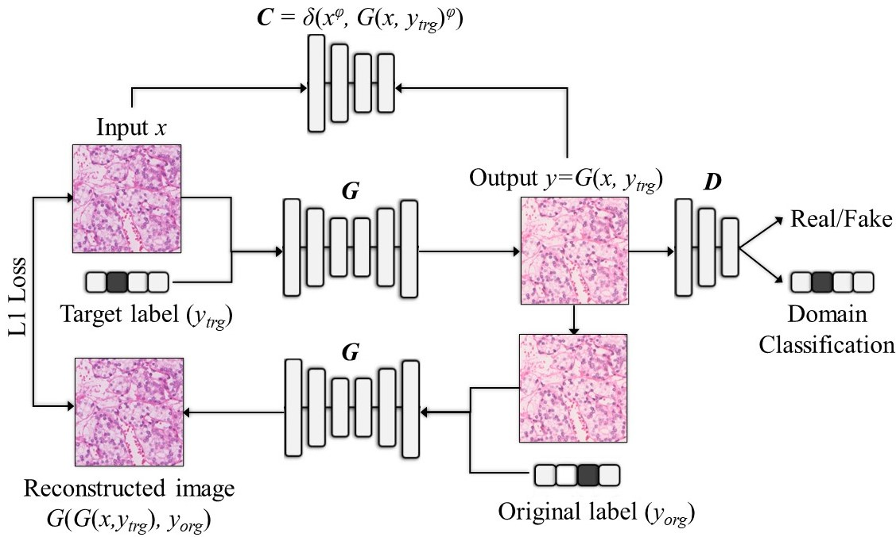
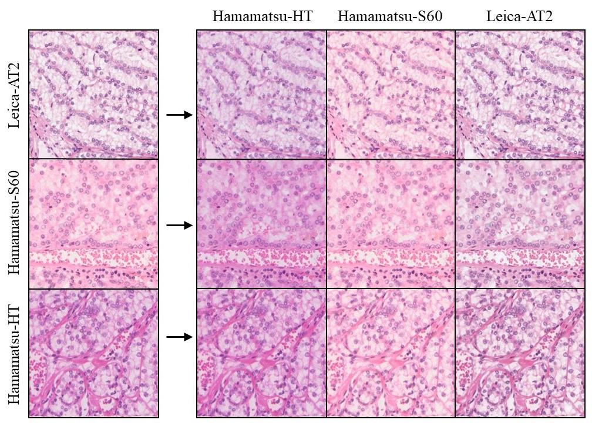
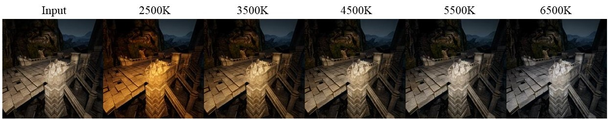

# MultiPathGAN
This repository provides the PyTorch implementation of the following paper:
> **MultiPathGAN: Structure Preserving Stain Normalization using Unsupervised Multi-domain Adversarial Network with Perception Loss**<br>
> [Haseeb Nazki](https://github.com/mlandcv)<sup>1</sup>, [Ognjen Arandjelović](https://risweb.st-andrews.ac.uk/portal/en/persons/oggie-arandelovic(fdd98ab1-564a-42a3-bf0c-fab7afbbd63c).html)<sup>1</sup>, [InHwa Um](https://risweb.st-andrews.ac.uk/portal/en/persons/in-hwa-um(0ac978a2-6ef8-4397-bc36-f920a77696a3).html)<sup>1</sup>, [David Harrison](https://risweb.st-andrews.ac.uk/portal/en/persons/david-james-harrison(6bb6c114-15d1-4b0d-9091-8ce3ce9c2c7d).html)<sup>1</sup><br/>
> <sup>1</sup>University of St-Andrews.<br/>
> https://arxiv.org/abs/2204.09782 <br>
>
> **Abstract:** *Histopathology relies on the analysis of microscopic tissue images to diagnose disease. A crucial part of tissue preparation is staining whereby a dye is used to make the salient tissue components more distinguishable. However, differences in laboratory protocols and scanning devices result in significant confounding appearance variation in the corresponding images. This variation increases both human error and the inter-rater variability, as well as hinders the performance of automatic or semi-automatic methods. In the present paper we introduce an unsupervised adversarial network to translate (and hence normalize) whole slide images across multiple data acquisition domains. Our key contributions are: (i) an adversarial architecture which learns across multiple domains with a single generator-discriminator network using an information flow branch which optimizes for perceptual loss, and (ii) the inclusion of an additional feature extraction network during training which guides the transformation network to keep all the structural features in the tissue image intact. We: (i) demonstrate the effectiveness of the proposed method firstly on H\&E slides of 120 cases of kidney cancer, as well as (ii) show the benefits of the approach on more general problems, such as flexible illumination based natural image enhancement and light source adaptation.*

*Figure 1. Model Architecture* 
<p align="center"></p>


*Figure 2. Translation results between WSI patches from three different scanning devices*
<p align="center"></p>

 
*Figure 3. Translating input to 5 color temperatures (MultiPathGAN trained on [VIDIT](https://github.com/majedelhelou/VIDIT))* 
<p align="center"></p>


## Prerequisites
* [Python 3.5+](https://www.continuum.io/downloads)
* [PyTorch 0.4.0+](http://pytorch.org/)
* [TensorFlow 1.14+](https://www.tensorflow.org/) (optionally to use tensorboard)

## Prepare Dataset
#### 1. Split wsi patches into train/test/sample sets.  
#### 2. Save images in the folders in the same format as shown below:


    data
    └── WSI
        ├── train
        |   ├── Domain 1
        |   |   ├── a.jpg  (name doesn't matter)
        |   |   ├── b.jpg
        |   |   └── ...
        |   ├── Domain 2
        |   |   ├── c.jpg
        |   |   ├── d.jpg
        |   |   └── ...
        |   ...
        |
        └── test
        |   ├── Domain 1
        |   |   ├── e.jpg
        |   |   ├── f.jpg
        |   |   └── ...
        |   ├── Domain 2
        |   |   ├── g.jpg
        |   |   ├── h.jpg
        |   |   └── ...
        |   ...
        |
        └── input_sample_dir
            └── Input_Domain
                ├── e.jpg
                ├── f.jpg
                └── ...
            
            
## Training, testing and sampling MultiPathGAN on your dataset
To train on your own dataset, run the script provided below. 
```bash
# Train MultiPathGAN
python main.py --mode train
```
To test your trained network, run the script provided below.
```bash
# Test MultiPathGAN
python main.py --mode test 
```
To sample (translate test directory) to particular domain, run the script provided below.
```bash
# Sample MultiPathGAN
python main.py --mode sample --which_domain 0 --batch_size 1
```
Change necessary arguments [here]().

## Citation
If you find this work useful for your research, please cite our [paper](https://arxiv.org/abs/2204.09782).

## References

[1] [StarGAN_Implementation](https://github.com/yunjey/stargan) and [paper](https://arxiv.org/abs/1711.09020). 
Yunjey Choi, Minje Choi, Munyoung Kim, Jung-Woo Ha, Sunghun Kim, and Jaegul Choo. 2018. Stargan: Unified generative adversarial networks for multi-domain image-to-image translation. In Proceedings of the IEEE conference on computer vision and pattern recognition. 8789–8797.

[2] [AR-GAN_Implementation](https://github.com/mlandcv/Auxilliary_Reconstruction_GAN) and [paper](https://arxiv.org/abs/1909.11915).
Haseeb Nazki, Sook Yoon, Alvaro Fuentes, and Dong Sun Park. 2020. Unsupervised image translation using adversarial networks for improved plant disease recognition. Computers and Electronics in Agriculture 168 (2020), 105117.

